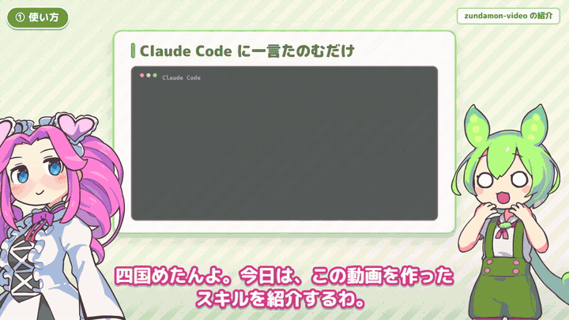

# zundamon-video

**Claude Code に「〇〇を解説するずんだもん動画を作って」と頼むだけで、ずんだもんと四国めたんが掛け合いで解説する動画（1920×1080・mp4）ができる**、ツールキットと Claude Code スキルです。

[](https://github.com/dikmri/zundamon-video/releases/download/v0.1.0/zundamon-video-promo.mp4)

▶ **[紹介動画を見る（2分15秒）](https://github.com/dikmri/zundamon-video/releases/download/v0.1.0/zundamon-video-promo.mp4)** — この紹介動画も、このスキルで作りました。

## できること

- **頼むだけ**: 題材の調査 → 台本と図解ボード → 音声合成 → 画面の確認と修正 → mp4 の書き出しまでを Claude が進めます。
- **声**: VOICEVOX のずんだもん・四国めたん。英字や略語の読みは辞書で指定できます。
- **立ち絵**: 坂本アヒルさんの立ち絵素材で、口パク（母音ごと）・まばたき・表情（12〜13種）・腕のポーズ（7〜10種）をセリフごとに切り替えます。
- **図解ボード**: HTML / CSS で自由に描けて、セリフに合わせて1つずつ表示（ポップ、蛍光ペン、数字のカウントアップ、タイプ表示など）。
- **字幕と音**: 話者の色で縁取った字幕、BGM、効果音。音量は -16 LUFS にそろえます。
- **AI の作例**: 画像生成（WAI-Anima）や動画生成（MiniMax H3）で作った画像・動画をボードに埋め込めます。動画の音は本編に混ざり、その間 BGM が下がります。
- **速さ**: 5分の動画の書き出しが約5分（4並列）。時刻を決めると同じ絵が必ず出る作りなので、何度書き出しても同じ動画になります。

## 作例

| 動画 | 内容 | 台本 |
|---|---|---|
| [紹介動画（2分15秒）](https://github.com/dikmri/zundamon-video/releases/download/v0.1.0/zundamon-video-promo.mp4) | このスキルの紹介 | [`projects/promo`](projects/promo) |
| [MiniMax H3 の解説（4分41秒）](https://github.com/dikmri/zundamon-video/releases/download/v0.1.0/example-minimax-h3.mp4) | 動画生成 AI「MiniMax H3」の概要・スペック・プロンプトのコツ | [`projects/h3`](projects/h3) |
| [きりたんのアニメ PV づくり（5分7秒）](https://github.com/dikmri/zundamon-video/releases/download/v0.1.0/example-kiritan-pv.mp4) | ComfyUI の導入から WAI-Anima の画像生成、H3 の動画生成までを初心者向けに。作例の画像と動画は実際にローカルで生成 | [`projects/kiritan`](projects/kiritan) |
| （約19秒） | 最小のサンプル | [`projects/sample`](projects/sample) |

## しくみ

```
projects/<名前>/script.json + boards/*.html     台本（セリフ・表情・ポーズ・ボード）
  → VOICEVOX でセリフを合成（キャッシュあり）
  → モーラの時刻から口パク、セリフの長さからタイムラインを計算
  → out/<名前>/index.html + data.js + audio.wav   時刻 t の画面を組み立てる HTML プレイヤー
  → Playwright（Chromium）で全フレームを撮影 → ffmpeg で mp4
```

## 必要なもの

- Windows 10 / 11
- [uv](https://docs.astral.sh/uv/)、[ffmpeg / ffprobe](https://ffmpeg.org/)（PATH に入れる）、[7-Zip](https://www.7-zip.org/)、git
- 空き容量 約6GB（VOICEVOX エンジン、Chromium、素材）
- [Claude Code](https://claude.com/claude-code)（頼むだけで作る場合）
- GPU は不要です（VOICEVOX は CPU 版を使います）。AI の作例を自分で生成する場合だけ、NVIDIA の GPU と ComfyUI が要ります（後述）。

## セットアップ

```bash
git clone https://github.com/dikmri/zundamon-video
cd zundamon-video
uv sync
uv run python -m zvideo.setup_env
```

`setup_env` は、VOICEVOX エンジン（約1.8GB）、公式の立ち絵、フォント、BGM、効果音、描画用の Chromium をすべてプロジェクト内（`runtime/` と `assets/`）に取得し、立ち絵をパーツに分けて書き出します。素材は各配布元の規約により、このリポジトリには含めていません。

### 立ち絵（坂本アヒルさんの素材）だけは手動で取得する

配布元のアップローダーがダウンロード時に利用規約への同意を求めるため、自動では取得しません。

| 素材 | 配布ページ（説明文にダウンロード先とパスワード） | 置く場所 |
|---|---|---|
| ずんだもん立ち絵素材 V3.2 | https://seiga.nicovideo.jp/seiga/im11206626 | `runtime/sozai_src/ahiru/zundamon_v3.2.zip` |
| 四国めたん立ち絵素材 2.1 | https://seiga.nicovideo.jp/seiga/im10791276 | `runtime/sozai_src/ahiru/metan_2.1.zip` |

置いたら、もう一度 `uv run python -m zvideo.setup_env` を実行します。

### Claude Code にスキルを入れる

```bash
uv run python -m zvideo.install_skill
```

`skill/zundamon-video` を `~/.claude/skills/zundamon-video` にコピーし、ツールキットの場所を書き込みます。

## 使い方

### Claude Code に頼む

Claude Code で、たとえば次のように頼みます。

> MiniMax H3 を解説するずんだもん動画を作って

Claude はスキルの手順に沿って、題材を調べ、`projects/<名前>/` に台本とボードを書き、画面を撮って確認しながら直し、`out/<名前>/<名前>.mp4` に書き出します。

### 自分で動かす

| コマンド | 用途 |
|---|---|
| `uv run python -m zvideo build projects/<名前>/script.json` | 音声合成・タイムライン・音声まで作る（尺が分かる） |
| `uv run python -m zvideo frames projects/<名前>/script.json --at 5 30` | 指定した秒の画面を PNG で保存する |
| `uv run python -m zvideo preview projects/<名前>/script.json` | ブラウザで音声つき再生・シークする |
| `uv run python -m zvideo render projects/<名前>/script.json --workers 4` | mp4 に書き出す |
| `uv run pytest -q` | テスト |

台本の書き方は [`skill/zundamon-video/references/script-schema.md`](skill/zundamon-video/references/script-schema.md)、ずんだもん解説動画の構成・口調・演出の型は [`format.md`](skill/zundamon-video/references/format.md) にまとめてあります。最小の台本はこんな形です。

```json
{
  "meta": {"title": "テスト", "bgm": "assets/bgm/maou_loop_bgm_acoustic50.mp3", "reading": {"API": "エーピーアイ"}},
  "cast": {"metan": {"character": "metan", "position": "left"},
           "zundamon": {"character": "zundamon", "position": "right"}},
  "scenes": [
    {"board": {"layout": "title", "heading": "APIってなに？"},
     "lines": [{"who": "zundamon", "text": "ずんだもんなのだ！", "face": "excited", "pose": "raise"},
               {"who": "metan", "text": "四国めたんよ。よろしくね。"}]}
  ]
}
```

ログは `logs/zvideo.log`（1行1イベント: `時刻 | イベント | 引数 | 結果`）に出ます。

## AI の作例を入れる（任意）

画像生成・動画生成の解説では、実際に生成したものをボードに載せられます（`` / `<video class="clip" data-clip="...">`）。

- **画像（WAI-Anima / Anima 系）**: `uv run python tools/anima_gen.py projects/<名前>/media/anima_spec.json --comfy-root <ポータブル版 ComfyUI>`
  - モデル: [WAI-ANIMA](https://civitai.com/models/2544636)（本体・専用テキストエンコーダー・VAE の3ファイル）
  - 作例は全年齢に固定しています（レーティングは safe のみ受け付け、否定プロンプトに成人向けタグを必ず加えます）。
- **動画（MiniMax H3）**: H3 の入った ComfyUI（0.30 以降）を起動して `uv run python tools/h3_gen.py --image <最初のコマ> --prompt-file <txt> --out <mp4> --url <ComfyUI の URL>`
  - モデル: Hugging Face [Comfy-Org/MiniMax-H3](https://huggingface.co/Comfy-Org/MiniMax-H3)（本体・テキストエンコーダー・映像/音声 VAE・高速化 LoRA、計 約45GB）
  - RTX 5060 Ti 16GB / メモリ 64GB で、480p・5秒が約4分でした。

## 素材・クレジット・規約

このリポジトリには素材を含めていません。使うときは、各規約に従ってクレジットを入れてください（作例のエンディングにも入れています）。

| 素材 | 取得元 | 条件（要点） |
|---|---|---|
| 音声 | [VOICEVOX](https://voicevox.hiroshiba.jp/) | 動画に `VOICEVOX:ずんだもん` `VOICEVOX:四国めたん` の表記が必要 |
| キャラクター | [東北ずん子・ずんだもんプロジェクト](https://zunko.jp/guideline.html) | キャラクター利用ガイドラインに従う（イメージを著しく損なう使い方は禁止など） |
| 立ち絵（既定） | 坂本アヒル 立ち絵素材（上記） | 公式規約の範囲で利用可。素材そのものの再配布はしない |
| 立ち絵（公式版） | [zunko.jp 公式イラスト](https://zunko.jp/con_illust.html) | 同上のガイドラインに従う |
| BGM | [魔王魂](https://maou.audio/rule/) | `音楽：魔王魂` の表記が必要 |
| 効果音 | [効果音ラボ](https://soundeffect-lab.info/agreement/) | 表記は任意。効果音が主役のコンテンツや再配布は不可 |
| フォント | M PLUS Rounded 1c / Dela Gothic One（Google Fonts） | SIL Open Font License |
| 作例の生成画像・動画（`projects/kiritan`・`projects/promo`） | WAI-ANIMA（WAI0731）/ Anima（CircleStone Labs・Comfy Org）/ MiniMax H3 で生成 | AI 生成物。WAI-Anima のモデル自体は非商用、H3 は利用地域の条件と AI 生成の明示が必要 |

## ライセンス

ソースコードは [MIT License](LICENSE) です。上記の素材・モデルには含まれず、それぞれの規約に従います。
